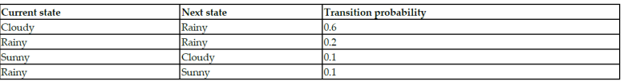
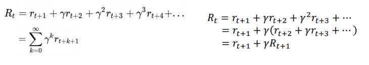
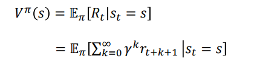
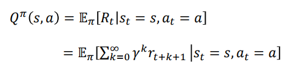
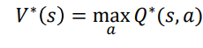
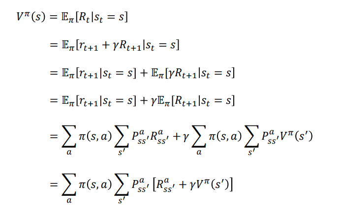
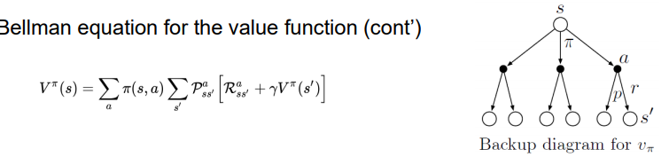

# MDP(mkarov decision process)의 기반 개념

### Markov Property

- 미래는 단지 현재에만 기반(과거에는 기반 x)

### Markov Chain

- 현재 state를 기반으로 미래 state를 예측하는 확률 모델
- Markov Property를 따름

#### Transition

- state에서 다른 state

#### Transtition probability

- transition의 확률
  

# MDP

- MarkovChain의 확장버전(state+action)

## 5개의 중요 요소

1. States: agent가 현재 있는 상태 집합
2. Actions: agent에 의해 행동되는 집합
3. Transition Probability: action a에 의해서 s->s'로 갈 확률
4. Reward Probability: action a에 의해 s->s'로 갈때 받은 reward의 확률
5. Discount factor(감마): 현재와 미래의 reward 중요도(가중치)

## Episodic task vs Continuouis Task

1. Episodic Task

- terminal state 존재
- car racing 같은것

2. Continuous task

- terminalstate 존재하지 않음
- 개인 로봇

## Discount Factor

- continous task에서는 final state가 없기에 Rt 어떻게 정의??
  
- 가까울수록 중요하기에 r=0이면 현재가 중요 r=1에 가까우면 미래가 더 중요
- hyperparamter이기에 우리가 정의해야함

## Policy function(파이)

- state에 대한 action mapping
- 최종목표는 optimal policy 찾기(max return)

## Value Function(V(s))

- policy 파이를 따랐을때 해당 state가 agent에게 얼마나 좋은가
  ``

## Q Function(state-action function)

- policy 파이를 따를때 해당 state에서 특정 action을 했을때 얼마나 좋은가?
  

# Bellman Equation and Optimality

- MDP를 푼다는것 = optimal value f 와 policy를 찾는것
- 즉 최적의 policy는 최적의 value f를 만듦
- optimal value f는 곧 maximum q function에 의해 생성
  - 즉 optimal value f는 maximum한 q function으로 계산가능
  - 

