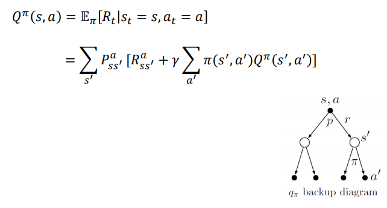

# Bellam Equation

#### Value F에 대한 Bellman Equation

#### Q F에 대한 Bellman Equation

#### optimal한 Bellman Equation

# Dynamic Programming

- 이미 주어진 perfect 한 모델(reward, state,action등..)을 사용해서 optimal policy찾기
- Bellman optimally equation을 풀어 optimal policy를 얻을 수 있음
  - 해당 과정을 DP라고 부름
  - DP는 하나의 큰 문제를 분할
  - 이미 계산된 작은 값으로 부터 큰 값 도출
- Bellamn Equation은 크게 두가지 사용 해결
  1. **Value Iteration**
  2. **Policy Iteration**

# Value Iteration

- 처음에는 randon value f로 시작
  - 반복적인 계산을 통해 optimal value f 찾음
  - optimal value f를 찾으면 optimal policy도 금방 찾음
- 크게 4가지 단계
  1. random value f로 초기화
  2. Q f 계산 -> 모든 state에 대해서 Q(s,a)
  3. value f 업데이트 = max Q(s,a)
  4. value f 업데이트의 차이가 매우 작아질때 까지 반복

# Policy Iteration

- 처음 random policy로 시작 -> value f 도출 (주어진 policy를 따르는) - 만약 value f가 optimal이 아니면 improve
  
- 다음 사진과 같이 크게 evaluation, improvement로 나뉨
- 총 4단계의 step
  1. ramdom policy로 초기화
  2. 위의 policy를 기반으로 value f를 도출 및 evaluate
     - optimal인지 체크
  3. optimal이 아니면 improved policy ( policy improvement)
  4. optimal policy를 찾을때 까지 반복
     - 새롭게 찾은 policy와 이전의 policy가 같으면 converged => optimal policy 찾은것

# Froken lake

## 해당 문제를 MDP

- states: 4\*4 grid state
- actions: left, right, up, down
- transition probabilites: action a에 의해 다른 state로 이동
- rewards probabilites: action a 에 대한 reward를 받을 확률
  (모두 미리 정의 필요하다)-> Bellman Equation을 DP로 풀기위해서

### Value Iteration code

### Poliocy Iteration code

- compute-value-function(policy-evaluation): 생성된 policy로 value F 를 생성(아마 for문 위치 바껴야 할듯? 오류인듯)
  
- extract policy(policy improvement): 생성된 value F를 가지고 Q F를 만들고 해당 Q F 로 새로운 policy 생성
  
