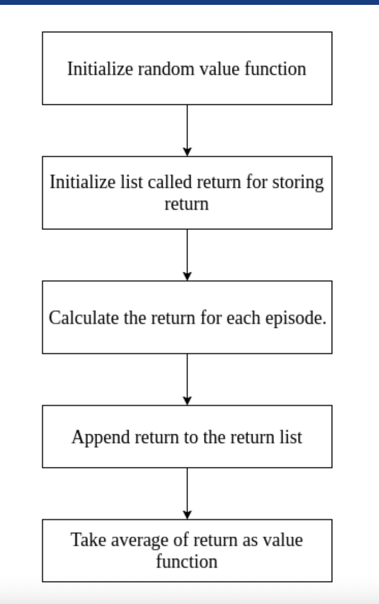

# Monte Carlo Methods
- env가 주어지지 않은 RL에서 주로 사용
     - 이전 Bellman Equation을 이용한 DP는 env(transition, rewrad등이 정의되어 있었음)
- random sampling 사용(표본 집단- 근사치)
    - episode 를 무한대까지 (이론적)

# Monthe carlo 를 이용한 파이 값 구하기
 
- monte carlo를 사용해서 대략적인 파이를 구할 수 있음(random sampling)

# Monte Carlo Prediction
- monte carlo methods는 단지 state, action, reward의 샘플만을 필요로 함
- episodic task에서만 가능(끝이 있어야함!) (terminal state가 있어야 sampling 가능)
- model이 필요없음 -> model-free-algorithm
- V(s) 대신 mean return 을 사용
    - 평균화하는것 -> 예상값으로 수렴
    - transition P를 모르기에 전체 state V에 대해 업데이트가 안되고 방문한 state에서만 update
- 주어진 policy를 사용

### Monte carlo prediction 단계
 
- first,every 모두 V(s)가 수렴함

# Monte Carlo Prediction(First visit)
- 하나의 episode에서 주어진 Policy에 따라 state가 방문되는데, 처음 방문한것만 고려
    - 처음 방문한것만 V(s)를 estimate
 
- 한 에피소드에 대해
- 역순으로 계산, 미래의 reward를 알기 위해
- unless문은 해당 state가 처음방문했을경우에만 
     - ex) R(Sa)=[G3,G4,G6]..
     - 즉 한에피소드에서 Sa가 계산될 수도 안될 수 도 있음

# Monte Carlo Prediction(Every visit)
- First visit과 전체적인것은 같음
- Unless문이 빠짐(모든 state방문 고려

# Blackjack with Monte Carlo
 
- action_space: hits or stand
- observation_space: 카드의 합 경우의수 (32), 딜러가 보여주는 카드 경우의 수 11, usable ace/unusable ace(2)

 
- 20 보다 크거나 같으면 stand, 아니면 hits

 
- 하나의 에피소드에서 나오는 state, actions, rewards list 추출

- generate_episode를 통해 인자로 받은 episode 갯수만큼 for문
- first visit이기에 만약 해당 에피소드에서 방문한적이 없으면 value table update
    - value table을 업데이트할때에는 이전에 구해진 평균값을 사용(퍙균값을 구하는 식 주의!!)
    

- 나의 카드 합/딜러카드/hits or stand(true인경우 stand)

