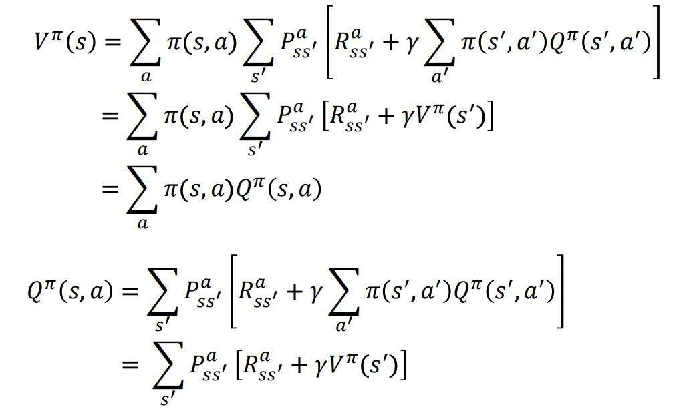
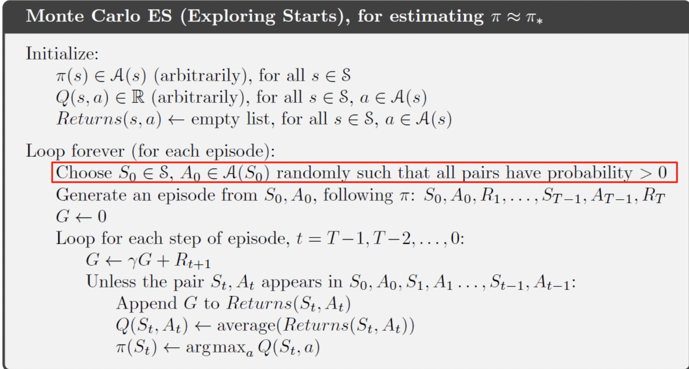
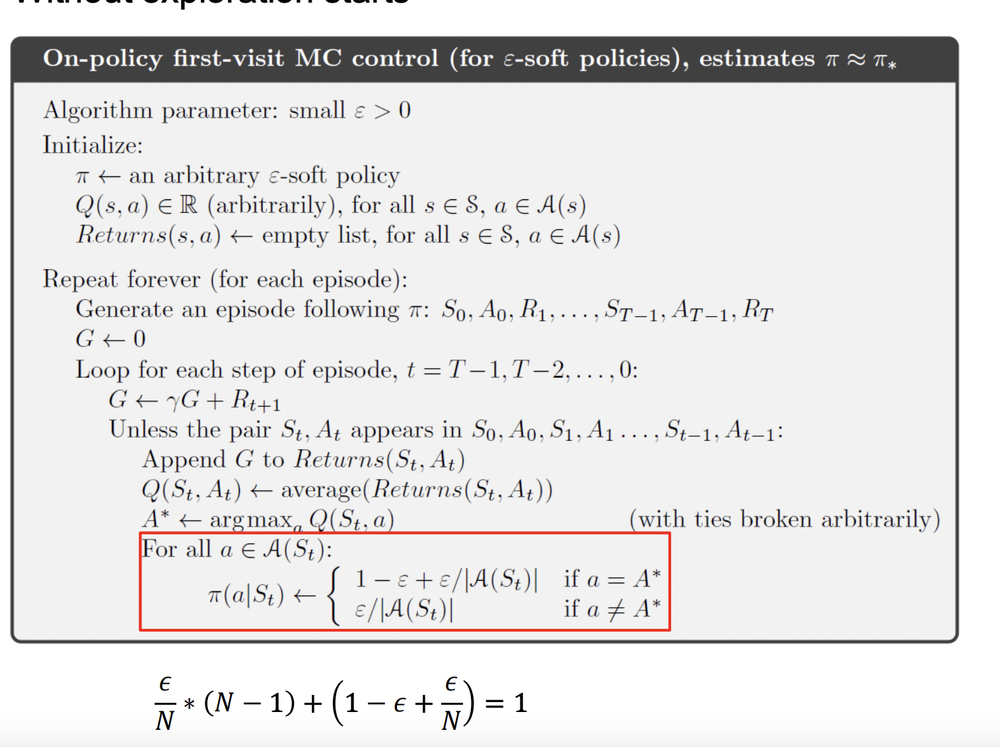

# Monte Carlo Control
- 이전과 같이 policy evaluation, policy improvement를 통해 Optimal policy를 구할 수 있음
- action value(Q)에 집중, state value보다
    - 환경을 모르기에 state value에 집중하는것은 좋은 선택이 아님!
    - state value는 우리가 선택한 Policy에 매우 의존적이기 때문
    - 이전 Blackjack도 Policy 20을 설정으로 했는데, 이거에 따라 많이 달라 질 수 있는거 봤지?

- 결국 V(s)에 Q가 연결되어 있는걸 생각!!
- 이러한 의문을 가질 수 있음 "여러번 episode를 통해 state를 방문하는데, 만약 방문하지 않은 state가 있다면?(극히 작은 확률이긴함)"
- 즉, 모든 가능한 action을 explore할 필요가 있음!

## Monte Carlo Exploration Starts
- MCES(Monte carlo exploring starts): 모든 episode는 random한 state에서 시작한다
- 이를 통해 정말 큰 수의 episode를 돌리면 모든 state를 cover 가능
### MCES의 최종 단계
1. Q, policy random value로 초기화
2. 위의 Random한 policy가지고 episode 시작
3. 2번의 return을 계산
4. 단지 unique한 state-action pair에 대해서만 계산(하나의 에피소드에도 특정 state가 여러번 방문될 수 있는데 이건 불필요한 정보이기떄문)
5. returns list의 평균값을 계싼하고 이를 Q f로 변환
6. max한 Q(s,a)를 찾아 Optimal policy improvemnent(greedy policy)
7. 엄청 큰 수의 에피소드를 통해 모든 state, action이 커버되도록 한다.

- Policy 파이, Q 랜덤값으로 초기화
- random한 Initial State 선택
- 뒤에서 부터 return 계산
- 만약 방문하지 않았다면, return 값 추가, 이후 Q에 해당 평균값 추가 (여기까지 policy evaluation)
- greedy policy를 통해  Policy 업데이트(policy improvement)

# On-Policy Monte Carlo Control
- e(입실론)-greedy policy
    - policy에 random성 부여
    - 입실론 만큼 작은 확률에서는 다른 action을 선택(제일 높은 Q-value를 버리고)
- 원래 greedy로만 하면, 아직 explore 하지 않은 어떠한 것이 있을 수 있다 = exploration-eploitation dilemma = trade-off 관계

- 빨간 부분 policy improvement