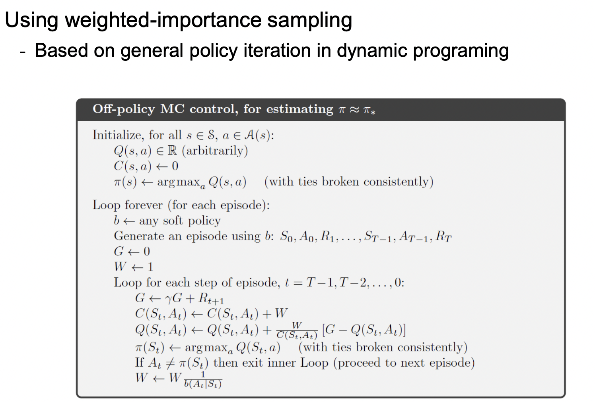

# Monte Carlo Control

- 이전과 같이 policy evaluation, policy improvement를 통해 Optimal policy를 구할 수 있음
- action value(Q)에 집중, state value보다
  - 환경을 모르기에 state value에 집중하는것은 좋은 선택이 아님!
  - state value는 우리가 선택한 Policy에 매우 의존적이기 때문
  - 이전 Blackjack도 Policy 20을 설정으로 했는데, 이거에 따라 많이 달라 질 수 있는거 봤지?

- 결국 V(s)에 Q가 연결되어 있는걸 생각!!
- 이러한 의문을 가질 수 있음 "여러번 episode를 통해 state를 방문하는데, 만약 방문하지 않은 state가 있다면?(극히 작은 확률이긴함)"
- 즉, 모든 가능한 action을 explore할 필요가 있음!

## Monte Carlo Exploration Starts

- MCES(Monte carlo exploring starts): 모든 episode는 random한 state에서 시작한다
- 이를 통해 정말 큰 수의 episode를 돌리면 모든 state를 cover 가능

### MCES의 최종 단계

1. Q, policy random value로 초기화
2. 위의 Random한 policy가지고 episode 시작
3. 2번의 return을 계산
4. 단지 unique한 state-action pair에 대해서만 계산(하나의 에피소드에도 특정 state가 여러번 방문될 수 있는데 이건 불필요한 정보이기떄문)
5. returns list의 평균값을 계싼하고 이를 Q f로 변환
6. max한 Q(s,a)를 찾아 Optimal policy improvemnent(greedy policy)
7. 엄청 큰 수의 에피소드를 통해 모든 state, action이 커버되도록 한다.

- Policy 파이, Q 랜덤값으로 초기화
- random한 Initial State 선택
- 뒤에서 부터 return 계산
- 만약 방문하지 않았다면, return 값 추가, 이후 Q에 해당 평균값 추가 (여기까지 policy evaluation)
- greedy policy를 통해 Policy 업데이트(policy improvement)

# On-Policy Monte Carlo Control

- e(입실론)-greedy policy
  - policy에 random성 부여
  - 입실론 만큼 작은 확률에서는 다른 action을 선택(제일 높은 Q-value를 버리고)
- 원래 greedy로만 하면, 아직 explore 하지 않은 어떠한 것이 있을 수 있다 = exploration-eploitation dilemma = trade-off 관계
  
- 빨간 부분 policy improvement
- without exploration start(위에 짤림)이기에 초기 시작 state random하기 선택 X
- FIRST VISIT
- A\*= 해당 episode에서 가장 좋은 action,
- n-1 개의 action들(복수!!)에 대해서는 E만큼 확률을 주고, 가장 좋았던 A\*에 대해선1-E만큼 확률을 준다

# Off-Policy Monte Carlo Control
- 두개의 Policy를 가짐
  - Target Policy: greedy policy, optimal policy를 찾도록 학습, π  policy라고도 불림
  - Behavior Policy: more exploratory, behavior의 목적을 가짐 -> E policy 사용, b policy라고도 불림
- target 과 behavior은 원래 서로 관련이 없음
- 목표는 target policy이지만, agent은 behavior policy 기반으로 행동함( action)
- π (a|s)>0 는 b(a|s)를 내재하고 있음 -> 즉 포함관계라는 뜻인듯??
  - π policy에서 일어나는건 무조건 b policy에도 일어나는것을 보장

## Importance Sampling
- Ordinary importance sampling
- Weighted importance sampling
- 주어진 samples 가지고 value estimating

## Off-Policy Prediction via Importance Sampling(Prediction임!!)
- prediction이기에 Policy 고정 및 주어짐
- π : target p
- b: behavior p
- 일반적으로 Off policy는 Importance sampling 방법을 사용하고, ratio를 사용
- 우리의 최종목표는 Vπ , Qπ 를 평가하는것( prediction 이기에)
  - 하지만 target!=behavior

- 해당 식을 보면 우리는 원래 transtition p 를 모르지만 결론적으로 ratio를 계산할때 약분이 됨!

- 하지만 epsisode sampling을 할때 사용하는건 b policy이기에 이걸 target policy(P)로 바꾸기위해선 위에서 구한 ratio를 사용해야함
- **주의** : 가중치(ratio)를 곱할때 T-1에 해당하는걸 곱해야함
  - 이전까지의 ratio 비율을 곱해줘야함

### Ordinary importance sampling vs Weighted importance sampling

- Ordinary
  - 단지 ratio*G(reward)의 합/전체 state 방문 횟수 로만 나눔
  - extrme case로 ratio가 10이라고 하면,
    - b policy에 비해 target p가 10배 더 많이 나올 수 있다는것임
    - 이것은 차이가 너무 커버릴 수 있는 단점이 있다. 
- Weighted
  - 분자는 같은데 부모가 ratio의 합으로 나누어짐 **분자 분모 약분되지 않음**
  - extrme case로 만약 state가 한번만 방문된 s가 있다고 가정하면, 위아래 약분되어서 Gt하나만 나옴
    - 해당 부분은 Vπ라기 보다는 Vb에 더 가깝다고 할 수 있음
- 하지만 대부분의 RL에서는 weighted가 더 좋음(어차피 수렴하기에?)

- b는 E-greedy policy를 따르기에 random initial state를 할 필요 없음
- 마지막에 Q f는 Weighted importance sampling과정을 거쳐 evaluation 하게 됨

## Off-policy Monte Carlo Control
- 위에서는 policy evaluation만 했지만 control은 imporvemnet를 통해 optimal policy찾음

- b는 E-greedy policy(모든 state 다 갈 수 있는 확률을 가짐)
- Q(s,a)까지 policy evaluation, 이후에는 Policy improvement
- if문이 걸렸다는건 E만큼 확률로 최적의 action이 아닌, 다른 action을 취했다
  - Weighted update할 필요 있음 -> behavior와 target p의 차이로 인해

